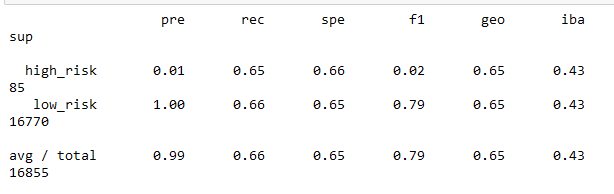
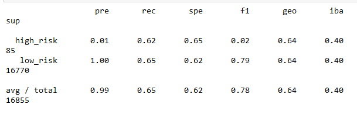
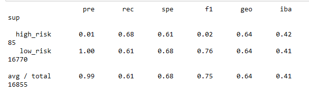
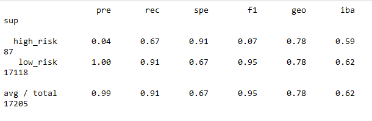
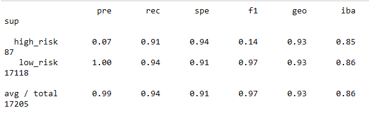

# credit-risk-analysis

## Overview
Using machine learning, the purpose of this analysis was to predict the credit risks using multiple machine learning frameworks to determine which one (if any) was the best to tackle the challenge.

## Results
using bulleted list, describe accuracy scores and precision/recall scores ofa ll six machine learning models. use screenshots to support your results

The following are the results summaries of each of the models tested with the data:

### Naive Random Oversampling

* Accuracy Score:   0.65
* Precision Scores:
    - High-Risk:    0.01
    - Low-Risk:     1.00
* Recall Scores:
    - High-Risk:    0.65
    - Low-Risk:     0.66

### SMOTE Oversampling

* Accuracy Score:   0.64
* Precision Scores:
    - High-Risk:    0.01
    - Low-Risk:     1.00
* Recall Scores:
    - High-Risk:    0.62
    - Low-Risk:     0.65

### Undersampling

* Accuracy Score:   0.65
* Precision Scores:
    - High-Risk:    0.01
    - Low-Risk:     1.00
* Recall Scores:
    - High-Risk:    0.68
    - Low-Risk:     0.61
    
### SMOTEENN (Over and Under)

* Accuracy Score:   0.64
* Precision Scores:
    - High-Risk:    0.01
    - Low-Risk:     1.00
* Recall Scores:
    - High-Risk:    0.72
    - Low-Risk:     0.56

### Balanced Random Forest Classifier (Ensemble)

* Accuracy Score:   0.79
* Precision Scores:
    - High-Risk:    0.04
    - Low-Risk:     1.00
* Recall Scores:
    - High-Risk:    0.67
    - Low-Risk:     0.91

### Easy Ensemble Classifier

* Accuracy Score:   0.93
* Precision Scores:
    - High-Risk:    0.07
    - Low-Risk:     1.00
* Recall Scores:
    - High-Risk:    0.91
    - Low-Risk:     0.94

The best-performing model was the Easy Ensemble Classifier, with the highest scores in accuracy, precision, and recall. While every model gave low risk the precision score of 1, no model was great at accurately predicting the precision scores. The highest-performing model for generating precise scores for high-risk credit was also the Easy Ensemble Classifier, performing at 0.07. 

## Summary
The dataset simply contains too many variables to be useful.
Firstly, because the ratio of high-risk to low-risk is skewed so far, an accuracy score of 0.93 (from the Easy Ensemble Classifier model) is not enough. If it predicted a "low-risk" value for every datapoint, it would still score very high on the accuracy.
Every model had a low precision for high-risk credit. This is a big problem because the consequences of a false positive can have devastating impacts on the consumer. 
It should be noted that no factors were removed in testing these models. There were over 80 factors included, and it is possible that limiting that number down could improve the efficacy of this model. However, as it curretnly stands, none of these models are reliable enough to accurately predict false-positives and more testing/training should be used before moving forward.